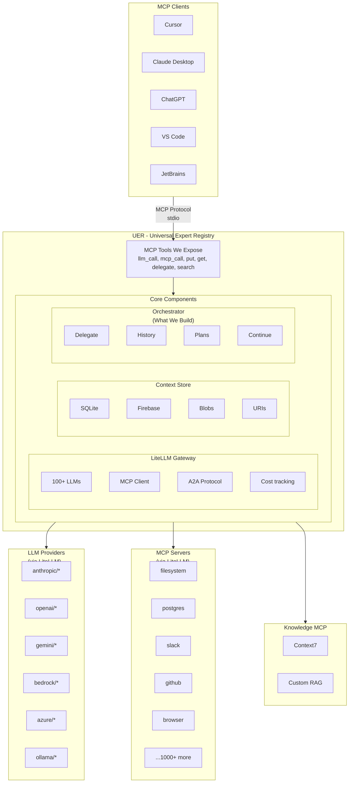

# ADR: Universal Expert Registry (Revised)

> **Project:** Universal Expert Registry  
> **Status:** Draft v2 - LiteLLM Architecture  
> **Date:** 2026-01-08  
> **Author:** Margus Martsepp  
> **Context:** AI Manipulation Hackathon - "The Risk Takers" Team

---

## 1. Executive Summary

### What Changed

**Original plan:** Build custom integrations for each LLM provider (Anthropic, OpenAI, Google, Azure, Bedrock, local).

**Revised plan:** Use [LiteLLM](https://github.com/BerriAI/litellm) as unified gateway - it already handles 100+ providers, has native MCP support, A2A protocol, cost tracking, and fallbacks.

### What We Build vs What We Reuse

| Component | Build | Reuse |
|-----------|-------|-------|
| LLM routing | ❌ | ✅ LiteLLM |
| Provider integrations | ❌ | ✅ LiteLLM |
| MCP client | ❌ | ✅ LiteLLM MCP Gateway |
| Cost tracking | ❌ | ✅ LiteLLM |
| Rate limiting | ❌ | ✅ LiteLLM |
| Fallbacks | ❌ | ✅ LiteLLM |
| **Context storage** | ✅ | - |
| **Subagent orchestration** | ✅ | - |
| **Chat history building** | ✅ | - |
| **MCP server (our tools)** | ✅ | - |

**Time savings:** ~60% of original effort eliminated.

### Core Value Proposition

1. **Call any LLM** - Single interface to 100+ providers
2. **Call any MCP tool** - Unified access to MCP ecosystem
3. **Share context efficiently** - URI references instead of copying data
4. **Build full chat histories** - Not just single messages to subagents
5. **Persist across sessions** - Continue complex tasks over days

---

## 2. Revised Architecture

### 2.1 High-Level Overview



### 2.2 What LiteLLM Provides (We Don't Build)

#### LLM Routing
```python
from litellm import completion

# Just change the model string - same interface for all
completion(model="anthropic/claude-sonnet-4-5-20250929", messages=[...])
completion(model="openai/gpt-5.2", messages=[...])
completion(model="gemini/gemini-3-flash-preview", messages=[...])
completion(model="bedrock/anthropic.claude-3-sonnet", messages=[...])
completion(model="azure/gpt-4-deployment", messages=[...])
completion(model="ollama/llama3.1:8b-instruct-q4_K_M", messages=[...])
```

#### MCP Client (Native Support)
```python
from litellm import experimental_mcp_client

# Load tools from any MCP server
tools = await experimental_mcp_client.load_mcp_tools(session, format="openai")

# Call MCP tools
result = await experimental_mcp_client.call_openai_tool(session, tool_call)
```

#### Automatic Features
- **Cost tracking**: Every response includes cost
- **Rate limiting**: Automatic retries with backoff
- **Fallbacks**: Auto-switch to backup provider on failure
- **Tool calling**: Normalized across all providers
- **Streaming**: Works identically everywhere

### 2.3 What We Build

#### 1. Context Store (Shared Memory)

```python
class ContextStore:
    """External memory that breaks context window limits."""
    
    def put(self, uri: str, data: dict) -> BlobMetadata:
        """Store blob (data, code, plan, result)."""
        
    def get(self, uri: str, query: str = None) -> Blob:
        """Retrieve blob, optionally with JSONPath query."""
        
    def search(self, pattern: str) -> List[BlobMetadata]:
        """Find blobs matching pattern."""
```

**Storage backends:**
- Local: SQLite + filesystem (hackathon default)
- Cloud: Firebase Firestore (team collaboration, future)

#### 2. Chat History Builder

```python
class ChatHistoryBuilder:
    """Build complete conversation context for subagents."""
    
    def __init__(self):
        self.messages = []
        self.tools = []
        self.context_refs = []  # URIs to large context
    
    def add_system(self, content: str):
        self.messages.append({"role": "system", "content": content})
    
    def add_user(self, content: str):
        self.messages.append({"role": "user", "content": content})
    
    def add_assistant(self, content: str, tool_calls: list = None):
        msg = {"role": "assistant", "content": content}
        if tool_calls:
            msg["tool_calls"] = tool_calls
        self.messages.append(msg)
    
    def add_tool_result(self, tool_call_id: str, result: str):
        self.messages.append({
            "role": "tool",
            "tool_call_id": tool_call_id,
            "content": result
        })
    
    def add_context_ref(self, uri: str):
        """Reference to large context stored in registry."""
        self.context_refs.append(uri)
    
    def build(self) -> dict:
        """Build complete request for LiteLLM."""
        return {
            "messages": self.messages,
            "tools": self.tools,
            "metadata": {"context_refs": self.context_refs}
        }
```

#### 3. Subagent Orchestrator

```python
class SubagentOrchestrator:
    """Delegate tasks to subagents with full context."""
    
    async def delegate(
        self,
        model: str,
        messages: List[dict],
        tools: List[dict] = None,
        context_refs: List[str] = None,
        store_result: str = None  # URI to store result
    ) -> DelegationResult:
        """
        Spawn subagent with complete chat history.
        
        1. Resolve context_refs → inject into messages
        2. Call LLM via LiteLLM
        3. Handle tool calls (loop)
        4. Store result if store_result URI provided
        5. Return result or URI reference
        """
        
        # Resolve large context from registry
        if context_refs:
            context_content = await self._resolve_refs(context_refs)
            messages = self._inject_context(messages, context_content)
        
        # Call LLM
        response = await litellm.acompletion(
            model=model,
            messages=messages,
            tools=tools
        )
        
        # Handle tool calls (agentic loop)
        while response.choices[0].message.tool_calls:
            tool_results = await self._execute_tools(
                response.choices[0].message.tool_calls
            )
            messages.append(response.choices[0].message)
            messages.extend(tool_results)
            response = await litellm.acompletion(
                model=model,
                messages=messages,
                tools=tools
            )
        
        # Store result
        result = response.choices[0].message.content
        if store_result:
            await self.store.put(store_result, {"result": result})
            return DelegationResult(uri=store_result, summary=result[:500])
        
        return DelegationResult(content=result)
```

#### 4. Plan Manager (Continuation)

```python
class PlanManager:
    """Manage multi-step plans for complex tasks."""
    
    async def create_plan(self, task: str, steps: List[PlanStep]) -> str:
        """Create plan, return URI."""
        plan = Plan(
            task=task,
            steps=steps,
            current_step=0,
            status="in_progress"
        )
        uri = f"registry://plans/{uuid4()}"
        await self.store.put(uri, plan.dict())
        return uri
    
    async def continue_plan(self, uri: str) -> ContinuationResult:
        """Resume plan from current step."""
        plan = await self.store.get(uri)
        
        while plan.current_step < len(plan.steps):
            step = plan.steps[plan.current_step]
            result = await self.execute_step(step)
            
            plan.steps[plan.current_step].result = result
            plan.current_step += 1
            await self.store.put(uri, plan.dict())
            
            # Check if we should yield (token budget, time limit)
            if self._should_yield():
                return ContinuationResult(
                    status="in_progress",
                    progress=plan.current_step / len(plan.steps),
                    continuation_uri=uri
                )
        
        plan.status = "complete"
        await self.store.put(uri, plan.dict())
        return ContinuationResult(status="complete", result=plan.final_result)
```

---

## 3. MCP Tools We Expose

### 3.1 llm_call

Call any LLM through LiteLLM.

```python
@tool
async def llm_call(
    model: str,                    # "anthropic/claude-sonnet-4-5-20250929", "openai/gpt-5.2", etc.
    messages: List[dict],          # Full chat history
    tools: List[dict] = None,      # Tool definitions
    temperature: float = 0.7,
    max_tokens: int = 4096,
    context_refs: List[str] = None # URIs to resolve and inject
) -> LLMResponse:
    """
    Call any LLM via LiteLLM unified interface.
    
    Supports: Anthropic, OpenAI, Google, Azure, AWS Bedrock, 
              Ollama, LM Studio, vLLM, and 100+ more.
    """
```

### 3.2 mcp_call

Call any configured MCP server.

```python
@tool
async def mcp_call(
    server: str,        # "filesystem", "postgres", "context7", etc.
    tool: str,          # Tool name from that server
    args: dict = None   # Tool arguments
) -> MCPResult:
    """
    Call tool on any configured MCP server.
    
    Uses LiteLLM's MCP client under the hood.
    """
```

### 3.3 put

Store data in registry.

```python
@tool
async def put(
    uri: str,           # "registry://context/doc_001"
    data: dict,         # Any JSON-serializable data
    ttl_hours: int = None  # Auto-expire
) -> PutResult:
    """Store blob in registry."""
```

### 3.4 get

Retrieve data from registry.

```python
@tool
async def get(
    uri: str,                    # "registry://context/doc_001"
    query: str = None           # JSONPath for partial retrieval
) -> Blob:
    """Retrieve blob from registry."""
```

### 3.5 search

Search across registry and MCP servers.

```python
@tool
async def search(
    query: str,
    type: str = "all"  # "mcp", "context", "plans", "all"
) -> SearchResults:
    """Search MCP servers, stored context, or plans."""
```

### 3.6 delegate

Spawn subagent with full context.

```python
@tool
async def delegate(
    model: str,                    # LLM to use
    task: str,                     # Task description
    messages: List[dict] = None,   # Full chat history (optional)
    tools: List[str] = None,       # MCP tools to make available
    context_refs: List[str] = None,# URIs to large context
    store_result: str = None       # URI to store result
) -> DelegationResult:
    """
    Spawn subagent with complete chat history and context.
    
    Key difference from simple LLM call:
    - Builds full conversation history
    - Resolves context URIs automatically
    - Can use MCP tools
    - Stores results back to registry
    """
```

### 3.7 plan_create / plan_continue

Manage multi-step workflows.

```python
@tool
async def plan_create(
    task: str,
    steps: List[dict]  # [{description, model, tools, context_refs}, ...]
) -> str:  # Returns plan URI
    """Create multi-step plan."""

@tool
async def plan_continue(
    uri: str  # Plan URI
) -> ContinuationResult:
    """Continue executing plan from current step."""
```

---

## 4. LiteLLM Configuration

### 4.1 Library Mode (Simple)

```python
# Direct usage in our code
import litellm
import os

os.environ["ANTHROPIC_API_KEY"] = "sk-ant-..."
os.environ["OPENAI_API_KEY"] = "sk-..."
os.environ["GEMINI_API_KEY"] = "..."

response = await litellm.acompletion(
    model="anthropic/claude-sonnet-4-5-20250929",
    messages=[{"role": "user", "content": "Hello!"}]
)
```

### 4.2 With Router (Fallbacks)

```python
from litellm import Router

router = Router(
    model_list=[
        {
            "model_name": "main",
            "litellm_params": {"model": "anthropic/claude-sonnet-4-5-20250929"}
        },
        {
            "model_name": "fallback",
            "litellm_params": {"model": "openai/gpt-5-mini"}
        }
    ],
    fallbacks=[{"main": ["fallback"]}],
    num_retries=3
)
```

### 4.3 MCP Server Configuration

```yaml
# config/litellm_config.yaml
mcp_servers:
  filesystem:
    transport: "stdio"
    command: "npx"
    args: ["-y", "@modelcontextprotocol/server-filesystem", "/allowed/path"]
  
  postgres:
    transport: "stdio"
    command: "npx"
    args: ["-y", "@modelcontextprotocol/server-postgres"]
    env:
      DATABASE_URL: "${DATABASE_URL}"
  
  context7:
    transport: "stdio"
    command: "npx"
    args: ["-y", "@upstash/context7-mcp"]
```

---

## 5. Implementation Plan (Revised)

### Phase 1: Core Foundation (Day 1 Morning) - 3 hours

**Goal:** MCP server skeleton + LiteLLM integration

```
□ Project setup
  □ uv init, dependencies (mcp, litellm, pydantic)
  □ Basic project structure

□ LiteLLM integration
  □ Create src/llm/gateway.py wrapper
  □ Test multi-provider calls
  □ Verify tool calling works

□ MCP server skeleton
  □ Create src/server.py
  □ Register llm_call tool
  □ Test with Claude Desktop
```

### Phase 2: Storage & Context (Day 1 Afternoon) - 3 hours

**Goal:** Context store with put/get/search

```
□ Storage layer
  □ src/storage/base.py - Protocol
  □ src/storage/local.py - SQLite + files
  □ put, get, search operations

□ MCP tools
  □ put tool
  □ get tool
  □ search tool

□ Test context sharing
  □ Store large document
  □ Retrieve via URI
  □ Partial retrieval with JSONPath
```

### Phase 3: MCP Client Integration (Day 1 Evening) - 3 hours

**Goal:** Call other MCP servers via LiteLLM

```
□ MCP client setup
  □ Configure LiteLLM MCP client
  □ Load filesystem MCP
  □ Load context7 MCP (if available)

□ mcp_call tool
  □ Route to configured servers
  □ Handle responses
  □ Error handling

□ Test MCP integration
  □ Read file via filesystem MCP
  □ Query documentation via context7
```

### Phase 4: Subagent Delegation (Day 2 Morning) - 3 hours

**Goal:** Spawn subagents with full chat history

```
□ Chat history builder
  □ src/tools/history.py
  □ Support all message types
  □ Context ref injection

□ Orchestrator
  □ src/tools/delegate.py
  □ Resolve context refs
  □ Agentic loop for tool calls
  □ Store results

□ delegate tool
  □ Full implementation
  □ Test with real subagent
```

### Phase 5: Plans & Continuation (Day 2 Afternoon) - 3 hours

**Goal:** Multi-step workflows that persist

```
□ Plan manager
  □ Plan schema
  □ CRUD operations
  □ Step execution

□ Tools
  □ plan_create
  □ plan_continue

□ Continuation pattern
  □ Yield on budget
  □ Resume from checkpoint
  □ Final synthesis
```

### Phase 6: Demo & Polish (Day 2 Evening) - 2 hours

**Goal:** Working demo

```
□ Demo scenarios
  □ Multi-LLM comparison
  □ Context sharing between subagents
  □ Continuation across messages

□ Documentation
  □ README complete
  □ Quick start guide
  □ Demo script

□ Polish
  □ Error messages
  □ Logging
  □ Cleanup
```

---

## 6. File Structure (Revised)

```
UER/
├── README.md                    # Quick start guide
├── ADR.plan.md                  # This document
├── TODO.md                      # Checklist
├── pyproject.toml
│
├── src/
│   ├── __init__.py
│   ├── server.py                # MCP server entry point
│   │
│   ├── llm/
│   │   ├── __init__.py
│   │   └── gateway.py           # LiteLLM wrapper
│   │
│   ├── mcp/
│   │   ├── __init__.py
│   │   └── client.py            # MCP client via LiteLLM
│   │
│   ├── storage/
│   │   ├── __init__.py
│   │   ├── base.py              # StorageBackend protocol
│   │   └── local.py             # SQLite + filesystem
│   │
│   ├── tools/
│   │   ├── __init__.py
│   │   ├── llm_call.py          # LLM invocation
│   │   ├── mcp_call.py          # MCP tool invocation
│   │   ├── crud.py              # put/get/search
│   │   ├── delegate.py          # Subagent orchestration
│   │   └── plans.py             # Plan management
│   │
│   ├── orchestration/
│   │   ├── __init__.py
│   │   ├── history.py           # Chat history builder
│   │   └── continuation.py      # Continuation manager
│   │
│   └── models/
│       ├── __init__.py
│       ├── blob.py              # Storage schemas
│       ├── message.py           # Chat message schemas
│       └── plan.py              # Plan schemas
│
├── config/
│   ├── litellm_config.yaml      # LiteLLM + MCP config
│   └── claude_desktop_config.json.example
│
└── tests/
    ├── test_llm.py
    ├── test_storage.py
    └── test_delegate.py
```

---

## 7. Dependencies (Simplified)

```toml
[project]
name = "uer"
version = "0.1.0"
requires-python = ">=3.11"
dependencies = [
    "mcp>=1.0.0",           # MCP SDK
    "litellm>=1.77.0",      # Unified LLM gateway (includes MCP client)
    "pydantic>=2.0.0",      # Data validation
    "httpx>=0.25.0",        # HTTP client
]

[project.optional-dependencies]
firebase = [
    "firebase-admin>=6.0.0",
]
dev = [
    "pytest>=7.0.0",
    "pytest-asyncio>=0.21.0",
]
```

**Note:** LiteLLM brings in everything we need for LLM calls and MCP client. We don't need separate provider SDKs.

---

## 8. Key Insights from LiteLLM Research

### 8.1 Native MCP Support

LiteLLM has **built-in MCP Gateway** (since v1.65.0):
- Acts as MCP client to call external MCP servers
- Converts MCP tools to OpenAI format for any LLM
- Supports stdio, HTTP, and SSE transports
- Permission management per API key/team

This means we can:
- Configure MCP servers in LiteLLM config
- Use `experimental_mcp_client` to call them
- Bridge non-MCP LLMs (like GPT) to MCP tools

### 8.2 A2A Protocol

LiteLLM supports Google's Agent-to-Agent protocol:
- MCP: Agent ↔ Tool communication
- A2A: Agent ↔ Agent communication

We can use A2A for complex multi-agent orchestration if needed.

### 8.3 Full API Surface

LiteLLM isn't just chat completions:
- `/chat/completions` - Chat
- `/completions` - Legacy completions
- `/embeddings` - Embeddings
- `/images` - Image generation
- `/audio/transcriptions` - Speech to text
- `/v1/messages` - Anthropic native format

Our `llm_call` tool can expose all these capabilities.

### 8.4 Tool/Function Calling

LiteLLM normalizes tool calling across providers:
```python
litellm.supports_function_calling(model="bedrock/anthropic.claude-3-sonnet")  # True
litellm.supports_parallel_function_calling(model="gpt-4-turbo")  # True
```

We can check capabilities before routing.

---

## 9. Open Questions (Resolved)

| Question | Resolution |
|----------|------------|
| Docker management? | **Defer** - Focus on LLM/MCP first |
| RAG implementation? | **Use Context7 MCP** - Already exists |
| Event delivery? | **Polling** for hackathon, notifications later |
| Firebase? | **Optional** - Local SQLite default |
| Claude skills? | **Investigate** - Can other LLMs use them? |

---

## 10. Success Criteria (Revised)

### Must-Have for Hackathon Demo

- [ ] MCP server runs in Claude Desktop
- [ ] `llm_call` works with Claude, GPT, Gemini
- [ ] `mcp_call` works with filesystem MCP
- [ ] `put`/`get` stores and retrieves context
- [ ] `delegate` spawns subagent with full history
- [ ] Context sharing via URIs works (token savings demo)

### Nice-to-Have

- [ ] Context7 MCP integration for docs
- [ ] Plan continuation across messages
- [ ] Cost tracking display
- [ ] Multiple MCP servers configured

### Future (Post-Hackathon)

- [ ] Firebase storage for team collaboration
- [ ] A2A protocol for agent-to-agent
- [ ] Docker expert systems
- [ ] Custom knowledge RAG

---

## Appendix: LiteLLM Quick Reference

### Call Any LLM
```python
from litellm import completion
response = completion(model="provider/model", messages=[...])
```

### With Fallbacks
```python
from litellm import Router
router = Router(model_list=[...], fallbacks=[...])
response = router.completion(model="main", messages=[...])
```

### MCP Tools
```python
from litellm import experimental_mcp_client
tools = await experimental_mcp_client.load_mcp_tools(session, format="openai")
```

### Provider Prefixes
| Prefix | Provider |
|--------|----------|
| `anthropic/` | Anthropic direct |
| `openai/` | OpenAI direct |
| `gemini/` | Google Gemini |
| `azure/` | Azure OpenAI |
| `bedrock/` | AWS Bedrock |
| `ollama/` | Ollama local |
| `lm_studio/` | LM Studio local |

---

*Last updated: 2026-01-08 - Revised for LiteLLM architecture*
