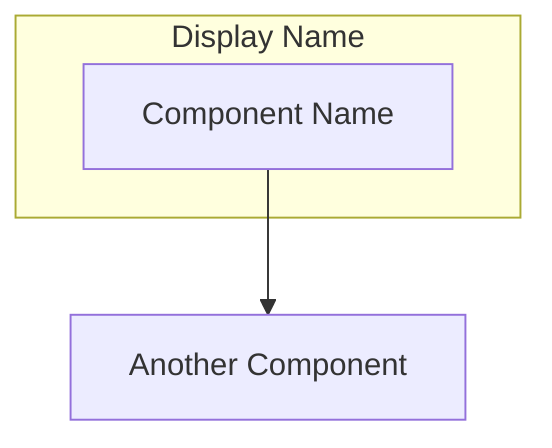

# Claude AI Assistant Reference

> **Last Updated:** January 8, 2026
> **Purpose:** Reference document for AI assistants working on this project

---

## Current LLM Model Versions (January 2026)

This document maintains the latest model identifiers for use in the Universal Expert Registry project. Update this file when new models are released.

### Anthropic Claude

| Model | LiteLLM ID | Released | Notes |
|-------|------------|----------|-------|
| Claude Sonnet 4.5 | `anthropic/claude-sonnet-4-5-20250929` | Sep 2025 | Current Sonnet, balanced performance |
| Claude Opus 4.5 | `anthropic/claude-opus-4-5-20251101` | Nov 2025 | Most capable, highest quality |

### OpenAI

| Model | LiteLLM ID | Released | Notes |
|-------|------------|----------|-------|
| GPT-5.2 | `openai/gpt-5.2` | Dec 2025 | Most capable for professional knowledge work, 70.9% human expert level on GDPval |
| GPT-5 mini | `openai/gpt-5-mini` | 2025 | Faster, cost-efficient version of GPT-5 |
| GPT-5.2-Codex | `openai/gpt-5.2-codex` | Jan 7, 2026 | State-of-the-art agentic coding, optimized for SWE-Bench Pro |

**Legacy models still supported:**
- Older GPT models (e.g., `openai/o1`, `openai/o1-mini`)

### Google Gemini

| Model | LiteLLM ID | Released | Notes |
|-------|------------|----------|-------|
| Gemini 3 Flash Preview | `gemini/gemini-3-flash-preview` | ~Dec 2025 | 1M token context, 3x faster than 2.5 Pro, 90.4% GPQA Diamond |
| Gemini 3 Pro Preview | `gemini/gemini-3-pro-preview` | ~Dec 2025 | Most capable Gemini model |

**Key Features:**
- 1M token context window
- Multimodal: text, images, audio, video, PDFs
- Configurable reasoning levels (minimal, low, medium, high)
- Automatic context caching
- 78% SWE-bench Verified score

**Legacy models still supported:**
- `gemini/gemini-2.0-flash`, `gemini/gemini-2.5-flash`, `gemini/gemini-2.5-pro`

### Local Models (Ollama)

| Model | LiteLLM ID | Notes |
|-------|------------|-------|
| Llama 3.1 8B Instruct | `ollama/llama3.1:8b-instruct-q4_K_M` | Q4_K_M quantization, ~4.58 GB |
| Generic format | `ollama/{model-name}:{tag}` | Use actual Ollama model tags |

### LM Studio

| Model | LiteLLM ID | Notes |
|-------|------------|-------|
| Llama 3.1 8B Instruct | `lm_studio/lmstudio-community/Meta-Llama-3.1-8B-Instruct-GGUF` | Full community path format |

---

## LiteLLM Model Naming Convention

### Format
```
provider/model-identifier
```

### Provider Prefixes

| Prefix | Provider | Example |
|--------|----------|---------|
| `anthropic/` | Anthropic (direct API) | `anthropic/claude-sonnet-4-5-20250929` |
| `openai/` | OpenAI (direct API) | `openai/gpt-5.2` |
| `gemini/` | Google Gemini (direct API) | `gemini/gemini-3-flash-preview` |
| `azure/` | Azure OpenAI Service | `azure/gpt-5-deployment` |
| `bedrock/` | AWS Bedrock | `bedrock/anthropic.claude-3-sonnet` |
| `vertex_ai/` | Google Vertex AI | `vertex_ai/gemini-3-flash-preview` |
| `ollama/` | Ollama (local) | `ollama/llama3.1:8b-instruct-q4_K_M` |
| `lm_studio/` | LM Studio (local) | `lm_studio/model-path` |
| `vllm/` | vLLM (self-hosted) | `hosted_vllm/meta-llama/Llama-3.1-70B` |

---

## Coding Standards & Best Practices

### Code Quality Principles

**Type Safety:**
- Use type hints everywhere: functions, methods, class attributes
- Run type checking: `mypy --strict src/`
- Type hint examples:
  ```python
  from typing import Optional, List, Dict, Any

  async def llm_call(
      model: str,
      messages: List[Dict[str, str]],
      tools: Optional[List[Dict[str, Any]]] = None
  ) -> Dict[str, Any]:
      ...
  ```

**Code Organization:**
- SOLID principles: Single responsibility, Open/closed, Liskov substitution, Interface segregation, Dependency inversion
- DRY (Don't Repeat Yourself): Extract repeated logic into functions/classes
- Clear separation: Protocol handlers → Business logic → Storage → External APIs
- One class/function per file when it exceeds 200 lines

**Error Handling:**
- Use specific exceptions, not generic `Exception`
- Always include context in error messages
- Log errors with structured logging
- Example:
  ```python
  class MCPError(Exception):
      """Base exception for MCP-related errors."""
      pass

  class InvalidModelError(MCPError):
      """Raised when model name is invalid or unsupported."""
      pass
  ```

### Testing Standards

**Test Coverage:**
- Aim for >80% code coverage
- Unit tests: Test individual functions/classes in isolation
- Integration tests: Test component interactions (LiteLLM → storage)
- E2E tests: Test full MCP server workflows

**Test Structure:**
- Use pytest with fixtures for dependency injection
- Use `pytest-asyncio` for async code
- Mock external APIs (LiteLLM, MCP servers)
- Example:
  ```python
  import pytest
  from unittest.mock import AsyncMock

  @pytest.fixture
  def mock_gateway():
      gateway = AsyncMock()
      gateway.call.return_value = {"response": "test"}
      return gateway

  @pytest.mark.asyncio
  async def test_llm_call(mock_gateway):
      result = await mock_gateway.call("gemini/gemini-3-flash-preview", [...])
      assert result["response"] == "test"
  ```

**Test Files:**
- Mirror source structure: `src/llm/gateway.py` → `tests/llm/test_gateway.py`
- Name tests clearly: `test_<function_name>_<scenario>_<expected_result>`
- Example: `test_llm_call_with_invalid_key_raises_error`

### Security Standards

**Input Validation:**
- Validate all user inputs and MCP tool arguments
- Use Pydantic models for automatic validation
- Never trust external data (LLM responses, MCP server responses)
- Example:
  ```python
  from pydantic import BaseModel, validator

  class LLMCallRequest(BaseModel):
      model: str
      messages: List[Dict[str, str]]

      @validator('model')
      def validate_model(cls, v):
          if '/' not in v:
              raise ValueError('Model must be in format provider/model')
          return v
  ```

**Secret Management:**
- NEVER commit API keys or secrets to git
- Use environment variables for all sensitive configuration
- Document required env vars in `.env.example`
- Use different keys for dev/staging/production

**API Key Protection:**
- Check for leaked keys in logs (redact before logging)
- Rotate keys regularly
- Use minimal permission scopes

### Logging Standards

**Structured Logging:**
- Use consistent log format: timestamp, level, component, message, context
- Log levels: DEBUG (dev), INFO (important events), WARNING (recoverable issues), ERROR (failures)
- Include request IDs for tracing
- Example:
  ```python
  import logging
  import structlog

  logger = structlog.get_logger(__name__)

  logger.info(
      "llm_call_completed",
      model="gemini/gemini-3-flash-preview",
      tokens=1234,
      cost=0.0012,
      duration_ms=450
  )
  ```

**What to Log:**
- ✅ LLM API calls (model, tokens, cost, duration)
- ✅ MCP tool invocations (tool name, args, result status)
- ✅ Errors with full context and stack traces
- ✅ Authentication/authorization events
- ❌ API keys, user data, sensitive information

### Performance Guidelines

**Async/Await:**
- Use async/await for all I/O operations (LLM calls, file I/O, network)
- Don't block the event loop
- Use `asyncio.gather()` for parallel operations
- Example:
  ```python
  # Good: Parallel execution
  results = await asyncio.gather(
      llm_call("gemini/gemini-3-flash-preview", messages),
      llm_call("anthropic/claude-sonnet-4-5-20250929", messages)
  )

  # Bad: Sequential execution
  result1 = await llm_call("gemini/...", messages)
  result2 = await llm_call("anthropic/...", messages)
  ```

**Resource Management:**
- Use context managers for file/connection handling
- Implement connection pooling for external APIs
- Set appropriate timeouts (default: 30s for LLM calls)
- Handle rate limits with exponential backoff

### Git & Version Control

**Commit Messages:**
- Format: `<type>(<scope>): <description>`
- Types: `feat`, `fix`, `docs`, `refactor`, `test`, `chore`
- Examples:
  - `feat(llm): add GPT-5.2 support`
  - `fix(storage): handle missing file gracefully`
  - `docs(readme): update API key instructions`

**Branch Strategy:**
- `master` or `main`: Production-ready code
- Feature branches: `feature/<name>` or `feat/<name>`
- Bug fixes: `fix/<issue-number>-<description>`
- Always create PRs, never commit directly to main

**PR Requirements:**
- Clear description of changes
- Link to related issues
- Tests added/updated
- Documentation updated if needed
- Code review approval required

### Documentation Standards

**Code Documentation:**
- Docstrings for all public functions, classes, methods
- Format: Google style or NumPy style (pick one, be consistent)
- Example:
  ```python
  async def llm_call(
      model: str,
      messages: List[Dict[str, str]],
      tools: Optional[List[Dict[str, Any]]] = None
  ) -> Dict[str, Any]:
      """Call any LLM via LiteLLM unified interface.

      Args:
          model: LiteLLM model identifier (e.g., "gemini/gemini-3-flash-preview")
          messages: List of chat messages with role and content
          tools: Optional list of tool definitions in OpenAI format

      Returns:
          Dict containing the LLM response with choices, usage, etc.

      Raises:
          InvalidModelError: If model format is invalid
          AuthenticationError: If API key is missing or invalid
          RateLimitError: If rate limit is exceeded

      Example:
          >>> result = await llm_call(
          ...     "gemini/gemini-3-flash-preview",
          ...     [{"role": "user", "content": "Hello"}]
          ... )
          >>> print(result["choices"][0]["message"]["content"])
      """
  ```

**Inline Comments:**
- Explain WHY, not WHAT (code should be self-documenting)
- Use comments for complex algorithms or non-obvious decisions
- Avoid stating the obvious: `# increment counter` is useless

### Development Workflow

**Before Committing:**
1. Run tests: `pytest tests/`
2. Check types: `mypy --strict src/`
3. Format code: `black src/ tests/`
4. Lint: `ruff check src/ tests/`
5. Review git diff carefully

**Dependencies:**
- Pin versions in `pyproject.toml` or `requirements.txt`
- Use `uv` for fast, reliable dependency management
- Document why each dependency is needed
- Regularly update dependencies and test

**Code Review Checklist:**
- [ ] Tests added/updated and passing
- [ ] Type hints present and correct
- [ ] Error handling implemented
- [ ] Logging added for important operations
- [ ] Documentation updated
- [ ] Security considerations addressed
- [ ] Performance impact considered

### Recommended Development Tools

**Code Quality:**
- `black` - Code formatter (opinionated, no config needed)
- `ruff` - Fast linter (replaces flake8, isort, pylint)
- `mypy` - Static type checker
- `pytest` - Testing framework
- `pytest-asyncio` - Async test support
- `pytest-cov` - Coverage reporting

**Development:**
- `uv` - Fast Python package manager
- `ipython` or `ptpython` - Better Python REPL
- `httpie` or `curl` - API testing
- `jq` - JSON processing

**Setup:**
```bash
# Install dev tools
uv add --dev black ruff mypy pytest pytest-asyncio pytest-cov pre-commit

# Install pre-commit hooks
pre-commit install

# Create pyproject.toml configuration
[tool.black]
line-length = 100
target-version = ['py311']

[tool.ruff]
line-length = 100
select = ["E", "F", "I", "N", "W"]

[tool.mypy]
python_version = "3.11"
strict = true
warn_return_any = true
warn_unused_configs = true

[tool.pytest.ini_options]
testpaths = ["tests"]
asyncio_mode = "auto"
```

**Pre-commit Hooks (Optional but Recommended):**
```yaml
# .pre-commit-config.yaml
repos:
  - repo: https://github.com/psf/black
    rev: 24.1.1
    hooks:
      - id: black
  - repo: https://github.com/astral-sh/ruff-pre-commit
    rev: v0.1.14
    hooks:
      - id: ruff
  - repo: https://github.com/pre-commit/mirrors-mypy
    rev: v1.8.0
    hooks:
      - id: mypy
```

## Project-Specific Notes

### Project Naming

**Official Project Name:** UER (Universal Expert Registry)

**Usage Guidelines:**
- **Directory name:** `UER/`
- **Package name:** `uer` (in pyproject.toml)
- **MCP Server identifier:** `uer` (in Server() initialization)
- **Full name for descriptions:** "UER - Universal Expert Registry" or "Universal Expert Registry (UER)"
- **Avoid:** `universal-expert-registry` (outdated, inconsistent)

### Architecture Diagrams

**Always use Mermaid for architecture diagrams** instead of ASCII art.

**Why Mermaid:**
- ✅ Renders beautifully in GitHub, GitLab, VS Code, and modern markdown viewers
- ✅ Easy to modify and version control
- ✅ Supports complex layouts and relationships
- ✅ More accessible and professional
- ❌ ASCII art is hard to maintain and looks dated

**Mermaid Graph Types:**
- `graph TB` / `graph LR` - Flowcharts (top-bottom, left-right)
- `sequenceDiagram` - Sequence diagrams for API flows
- `classDiagram` - Class relationships
- `stateDiagram-v2` - State machines

**Example Template:**


**Important Syntax Notes:**
- Always quote node text: `A["Text"]` not `A[Text]`
- Avoid pipe characters `|` in node text - use commas or other separators instead
- Line breaks in text: Use `<br/>` for multi-line labels
- Special characters: Quote the entire text string to be safe
- **DO NOT use colors or styling** - keep diagrams simple and clean (no `style` statements)

### Model Selection Guidelines

**For production examples in documentation:**
- Use latest stable models (not `-preview` unless that's the only version)
- Prefer models with broad availability
- Include both cloud and local options

**For cost-sensitive operations:**
- Use mini/flash variants: `gpt-5-mini`, `gemini-3-flash-preview`
- Consider local models for high-volume tasks

**For maximum capability:**
- Use flagship models: `claude-opus-4-5-20251101`, `gpt-5.2`

### Documentation Standards

**Quick Start Must-Haves:**
- Clear prerequisites (Python version, uv, Claude Desktop, API keys)
- Step-by-step instructions (numbered steps)
- **Free tier option first** - Always recommend Gemini free tier for testing
- Direct links to get API keys, especially https://aistudio.google.com/apikey
- Minimal configuration example (Gemini only)
- Full configuration example (all providers)
- Path examples for Windows AND Mac/Linux
- Test scenario to verify setup works
- Troubleshooting section for common errors

**API Key Documentation:**
- Provide table with provider name, signup link, and free tier info
- Show key format (e.g., `AIza...`, `sk-ant-...`, `sk-...`)
- Explain which keys are required vs optional
- Free tier = better adoption

**Configuration Examples:**
- Show minimal config first (single provider)
- Show full config second (all providers)
- Use placeholders like `C:\\path\\to\\UER` not actual paths
- Remind users to replace placeholders
- Show both Windows (`\\`) and Mac/Linux (`/`) path formats

**Example Usage:**
- Real, working examples users can copy-paste
- Show expected behavior/output
- Include error cases in troubleshooting

### Update Checklist

When new models are released, update these files:
- [ ] `CLAUDE.md` (this file)
- [ ] `README.md` - Examples in "Key Features" section
- [ ] `README.md` - Quick Start API key table
- [ ] `ADR.plan.md` - Architecture examples
- [ ] `TODO.md` - Test model lists
- [ ] `TODO.md` - Phase 1 environment configuration
- [ ] `docs/LITELLM_GUIDE.md` - Provider examples

### Version History

| Date | Update |
|------|--------|
| 2026-01-08 | Initial creation. Updated from older GPT/Gemini 2.5 to GPT-5.2/Gemini 3 Flash |
| 2026-01-08 | Added GPT-5.2-Codex (released Jan 7, 2026) |

---

## Important Context

### Date Context
- **Today:** January 8, 2026
- **Claude Assistant Knowledge Cutoff:** January 2025
- **Gap:** 1+ year - always fact-check current model versions via web search

### Naming Conventions
- Use "GPT" in prose, not "GPT-4" or "GPT-5" when referring to OpenAI models generically
- Example: "Call any LLM (Claude, GPT, Gemini...)" not "Claude, GPT-4, Gemini..."
- Use specific model identifiers in code: `openai/gpt-5.2`, `openai/gpt-5-mini`

### Why This File Exists
AI assistants (including Claude) have knowledge cutoffs and may suggest outdated model identifiers. This file serves as the source of truth for what models are actually current and available.

### When to Update
- Immediately when major model releases are announced
- When LiteLLM adds support for new models
- When models enter GA (general availability) from preview/beta

---

## External References

### Official Sources
- **OpenAI Models:** https://platform.openai.com/docs/models
- **Anthropic Models:** https://docs.anthropic.com/claude/docs/models-overview
- **Google Gemini:** https://ai.google.dev/gemini-api/docs/models
- **LiteLLM Providers:** https://docs.litellm.ai/docs/providers
- **LiteLLM Model List:** https://models.litellm.ai/

### Recent Announcements (2026)
- [Gemini 3 Flash Launch](https://blog.google/products/gemini/gemini-3-flash/) - ~Dec 2025
- [GPT-5.2 Release](https://openai.com/index/introducing-gpt-5-2/) - Dec 2025
- [GPT-5.2-Codex Launch](https://openai.com/index/introducing-gpt-5-2-codex/) - Jan 7, 2026
- [LiteLLM Gemini 3 Support](https://docs.litellm.ai/blog/gemini_3)

---

**Next Review Date:** April 2026 (or when major model releases occur)
