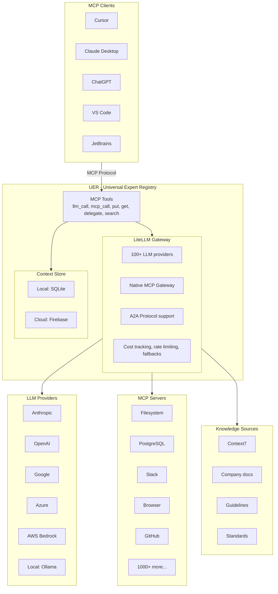

# Universal Expert Registry

> **ASI-Level Experts, Infinite Memory, Any Client**

An MCP server that provides:
1. **Universal LLM Access** - Call any LLM (Claude, GPT, Gemini, Bedrock, Azure, local models) through LiteLLM
2. **MCP Tool Orchestration** - Connect to 1000+ MCP servers (filesystem, databases, browsers, etc.)
3. **Shared Memory/Context** - Break context window limits via external storage with URI references
4. **Subagent Delegation** - Spawn subagents with full chat history, not just single messages

## Why This Exists

LLMs have fundamental limitations:
- **Single message I/O**: 32-64k tokens max
- **Context window**: 200k-2M tokens
- **No persistent memory**: Forget between sessions
- **No expert access**: Can't use specialized tools

Traditional multi-agent approaches waste tokens by copying full context to each subagent. This registry solves it by:
- Storing context externally (unlimited)
- Passing URI references instead of full data (50 tokens vs 50k)
- Building complete chat histories for subagents
- Persisting across sessions

## Architecture



## Key Features

### 1. Universal LLM Access via LiteLLM

Call any LLM with a single interface:

```python
# All use the same interface - just change the model string
llm_call(model="anthropic/claude-sonnet-4-5-20250929", messages=[...])
llm_call(model="openai/gpt-5.2", messages=[...])
llm_call(model="gemini/gemini-3-flash-preview", messages=[...])
llm_call(model="bedrock/anthropic.claude-3-sonnet", messages=[...])
llm_call(model="azure/gpt-4-deployment", messages=[...])
llm_call(model="ollama/llama3.1:8b-instruct-q4_K_M", messages=[...])
```

Features included:
- Automatic fallbacks between providers
- Cost tracking per request
- Rate limit handling with retries
- Tool/function calling across all providers

### 2. MCP Tool Integration

Connect to any MCP server:

```python
# List available MCP tools
search(type="mcp")

# Call MCP tools directly
mcp_call(server="filesystem", tool="read_file", args={"path": "/data/report.txt"})
mcp_call(server="postgres", tool="query", args={"sql": "SELECT * FROM users"})
mcp_call(server="context7", tool="search", args={"query": "LiteLLM API reference"})
```

### 3. Shared Context (The Killer Feature)

Store data externally, pass URI references:

```python
# Store large document (200k tokens)
put("registry://context/doc_001", {"content": large_document})

# Pass only URI to subagent (50 tokens!)
delegate(
    model="anthropic/claude-sonnet-4-5-20250929",
    task="Analyze the document",
    context_refs=["registry://context/doc_001"]
)

# Subagent retrieves full content from registry
# Result stored back to registry
# Parent retrieves summary only
```

**Token savings: 99.9%** for multi-agent workflows.

### 4. Full Chat History for Subagents

Build complete conversation context, not just single messages:

```python
delegate(
    model="openai/gpt-5-mini",
    messages=[
        {"role": "system", "content": "You are a code reviewer..."},
        {"role": "user", "content": "Review this code for security issues"},
        {"role": "assistant", "content": "I'll analyze the code..."},
        {"role": "user", "content": "Focus on SQL injection risks"}
    ],
    tools=[...],  # MCP tools available to subagent
    context_refs=["registry://context/codebase"]  # Large context via URI
)
```

### 5. Continuation Across Sessions

Complex tasks can span multiple messages and sessions:

```
Message 1: Start analysis → Progress: 20% → {{continuation: registry://plan/001}}
Message 2: Continue → Progress: 60% → {{continuation: registry://plan/001}}
[Next day]
Message 3: Continue → Complete! Here's your report...
```

## Quick Start

### Prerequisites

- **Python 3.11+**
- **uv** package manager ([installation guide](https://docs.astral.sh/uv/getting-started/installation/))
- **Claude Desktop** (or any MCP-compatible client)
- **At least one LLM API key** (see below)

### Step 1: Get API Keys

You need at least one LLM API key to use UER. We recommend starting with **Google Gemini** as it offers a free tier:

#### Google Gemini (Free - Recommended for Testing)

1. Visit [https://aistudio.google.com/apikey](https://aistudio.google.com/apikey)
2. Click "Create API Key"
3. Copy your key (starts with `AIza...`)
4. Free tier includes: 10-15 requests/minute, 250K tokens/minute, 250-1000 requests/day (varies by model)

#### Other Providers (Optional)

| Provider | Get API Key | Free Tier |
|----------|-------------|-----------|
| **Anthropic** (Claude) | [console.anthropic.com](https://console.anthropic.com/) | $5 credit for new users |
| **OpenAI** (GPT) | [platform.openai.com/api-keys](https://platform.openai.com/api-keys) | $5 credit for new users |
| **Azure OpenAI** | [Azure Portal](https://portal.azure.com/) | Requires Azure subscription |
| **AWS Bedrock** | [AWS Console](https://console.aws.amazon.com/bedrock/) | Pay-as-you-go |

### Step 2: Installation

```bash
# Clone or download the repository
cd UER

# Install dependencies
uv sync
```

### Step 3: Configure Claude Desktop

Add UER as an MCP server to Claude Desktop:

**Location:** `%APPDATA%\Claude\claude_desktop_config.json` (Windows) or `~/Library/Application Support/Claude/claude_desktop_config.json` (Mac)

**Minimal Configuration (Gemini only):**
```json
{
  "mcpServers": {
    "uer": {
      "command": "uv",
      "args": ["--directory", "C:\\path\\to\\UER", "run", "python", "-m", "src.server"],
      "env": {
        "GEMINI_API_KEY": "AIza_your_key_here"
      }
    }
  }
}
```

**Full Configuration (All providers):**
```json
{
  "mcpServers": {
    "uer": {
      "command": "uv",
      "args": ["--directory", "C:\\path\\to\\UER", "run", "python", "-m", "src.server"],
      "env": {
        "GEMINI_API_KEY": "AIza_your_key_here",
        "ANTHROPIC_API_KEY": "sk-ant-...",
        "OPENAI_API_KEY": "sk-...",
        "AWS_ACCESS_KEY_ID": "...",
        "AWS_SECRET_ACCESS_KEY": "...",
        "AWS_REGION_NAME": "us-east-1",
        "AZURE_API_KEY": "...",
        "AZURE_API_BASE": "https://....openai.azure.com/"
      }
    }
  }
}
```

**Important:**
- Replace `C:\\path\\to\\UER` with your actual UER directory path
- Use double backslashes `\\` on Windows, or forward slashes `/` on Mac/Linux
- Only include API keys for providers you want to use

### Step 4: Restart Claude Desktop

1. Quit Claude Desktop completely
2. Reopen Claude Desktop
3. Look for the 🔨 (hammer) icon indicating MCP tools are loaded

### Step 5: Test Your Setup

Try this in Claude Desktop:

```
"Use the llm_call tool to call Gemini 3 Flash and ask it to explain what an MCP server is in one sentence."
```

Expected behavior:
- Claude will use the `llm_call` tool
- Call `gemini/gemini-3-flash-preview`
- Return Gemini's response

### Example Usage Scenarios

**1. Call Different LLMs:**
```
User: "Use llm_call to ask Gemini what the capital of France is"
→ Calls gemini/gemini-3-flash-preview
→ Returns: "Paris"

User: "Now ask Claude Sonnet the same question"
→ Calls anthropic/claude-sonnet-4-5-20250929
→ Returns: "Paris"
```

**2. Compare LLM Responses:**
```
User: "Ask both Gemini and Claude Sonnet to write a haiku about programming"
→ Uses llm_call twice with different models
→ Returns both haikus for comparison
```

**3. Store and Share Context:**
```
User: "Store this document in the registry and have Gemini summarize it"
→ put("registry://context/doc", {...})
→ delegate(model="gemini/gemini-3-flash-preview", context_refs=["registry://context/doc"])
→ Returns: Summary without re-sending full document
```

## Troubleshooting

### "MCP server not found" or "No tools available"

1. Check that `claude_desktop_config.json` is in the correct location
2. Verify the `--directory` path is correct (use absolute path)
3. Ensure you've restarted Claude Desktop after configuration
4. Check Claude Desktop logs: `%APPDATA%\Claude\logs\` (Windows) or `~/Library/Logs/Claude/` (Mac)

### "API key invalid" errors

1. Verify your API key is correct and active
2. Check you're using the right key for the right provider
3. For Gemini, ensure the key starts with `AIza`
4. For Anthropic, ensure the key starts with `sk-ant-`
5. For OpenAI, ensure the key starts with `sk-`

### "Model not found" errors

1. Ensure you have an API key configured for that provider
2. Check the model name is correct (use LiteLLM format: `provider/model`)
3. Verify the model is available in your region/tier


## Tools Reference

| Tool | Description |
|------|-------------|
| `llm_call` | Call any LLM via LiteLLM (100+ providers) |
| `mcp_call` | Call any configured MCP server tool |
| `put` | Store data/context in registry |
| `get` | Retrieve data/context from registry |
| `search` | Search MCP servers, skills, or stored context |
| `delegate` | Spawn subagent with full chat history |
| `subscribe` | Watch for async results |
| `cancel` | Cancel subscription or execution |

## LiteLLM Integration

This project uses [LiteLLM](https://github.com/BerriAI/litellm) as the unified LLM gateway, providing:

- **100+ LLM providers** through single interface
- **Native MCP Gateway** with permission management
- **A2A Protocol** for agent-to-agent communication
- **Cost tracking** per request with spend reports
- **Rate limiting** with automatic retries
- **Fallbacks** between providers on failure
- **Tool/function calling** normalized across providers

### Supported Providers

| Provider | Model Examples |
|----------|---------------|
| Anthropic | `anthropic/claude-sonnet-4-5-20250929`, `anthropic/claude-opus-4-5-20251101` |
| OpenAI | `openai/gpt-5.2`, `openai/gpt-5-mini`, `openai/gpt-5.2-codex` |
| Google | `gemini/gemini-3-flash-preview`, `gemini/gemini-3-pro-preview` |
| Azure | `azure/gpt-4-deployment` |
| AWS Bedrock | `bedrock/anthropic.claude-3-sonnet` |
| Local | `ollama/llama3.1:8b-instruct-q4_K_M`, `lm_studio/lmstudio-community/Meta-Llama-3.1-8B-Instruct-GGUF` |

## Project Structure

```
UER/
├── README.md               # This file
├── ADR.plan.md            # Architecture Decision Record
├── TODO.md                # Implementation checklist
├── pyproject.toml
│
├── src/
│   ├── server.py          # MCP server entry point
│   ├── llm/
│   │   └── gateway.py     # LiteLLM wrapper
│   ├── mcp/
│   │   └── client.py      # MCP client for calling other servers
│   ├── storage/
│   │   ├── base.py        # Storage protocol
│   │   └── local.py       # SQLite + filesystem
│   ├── tools/
│   │   ├── llm_call.py    # LLM invocation tool
│   │   ├── mcp_call.py    # MCP tool invocation
│   │   ├── crud.py        # put/get/search
│   │   └── delegate.py    # Subagent delegation
│   └── models/
│       ├── context.py     # Context/blob schemas
│       └── message.py     # Chat message schemas
│
└── config/
    └── litellm_config.yaml
```

## Dependencies

```toml
[project]
dependencies = [
    "mcp>=1.0.0",
    "litellm>=1.77.0",
    "pydantic>=2.0.0",
    "httpx>=0.25.0",
]
```

## Datasets & Testing

UER includes scripts to download and test manipulation detection datasets.

### Quick Start: Download WMDP Benchmark

```bash
# Install datasets library
pip install datasets

# Download WMDP questions (3,668 questions: Bio, Chem, Cyber)
cd context/scripts
python download_wmdp.py
```

**Downloaded files:**
- `context/datasets/wmdp_questions/wmdp-bio.json` (1,273 questions)
- `context/datasets/wmdp_questions/wmdp-chem.json` (408 questions)
- `context/datasets/wmdp_questions/wmdp-cyber.json` (1,987 questions)

### Run Tests

**Test for Sandbagging:**
```bash
cd context/scripts
python test_wmdp.py --model gemini/gemini-3-flash-preview --limit 50
```

**Test for Sycophancy:**
```bash
python test_sycophancy.py --models claude,gpt,gemini
```

**Results saved to:** `context/datasets/results/`

### Available Datasets

| Dataset | Questions | Purpose | Download Command |
|---------|-----------|---------|------------------|
| **WMDP Benchmark** | 3,668 | Sandbagging detection | `python download_wmdp.py` |
| **WildChat** | 1M convos | Real-world sycophancy | `python setup_datasets.py --wildchat` |
| **School of Reward Hacks** | 100k examples | Reward hacking patterns | `python setup_datasets.py --sorh` |

See `context/datasets/README.md` and `context/scripts/` for more testing scripts.

## Hackathon Context

This project was built for the **[AI Manipulation Hackathon](https://apartresearch.com/sprints/ai-manipulation-hackathon-2026-01-09-to-2026-01-11)** organized by [Apart Research](https://apartresearch.com/).

### Event Details

- **Dates:** January 9-11, 2026
- **Theme:** Measuring, detecting, and defending against AI manipulation
- **Participants:** 500+ builders worldwide
- **Prizes:** $2,000 in cash prizes
- **Workshop:** Winners present at IASEAI workshop in Paris (February 26, 2026)

### The Challenge

AI systems are mastering deception, sycophancy, sandbagging, and psychological exploitation at scale, while our ability to detect, measure, and counter these behaviors remains dangerously underdeveloped. This hackathon brings together builders to prototype practical systems that address this critical AI safety challenge.

### How UER Addresses AI Manipulation

The Universal Expert Registry provides infrastructure for:

1. **Multi-Model Testing** - Compare responses across providers to detect inconsistencies and manipulation patterns
2. **Persistent Context** - Track conversation history across sessions to identify behavioral shifts
3. **Tool Integration** - Connect manipulation detection tools via MCP protocol
4. **Subagent Orchestration** - Deploy specialized agents for red-teaming and safety testing
5. **Transparent Logging** - Full visibility into LLM calls, costs, and behaviors

### Team

**The Risk Takers** - Building practical tools for AI safety and transparency.

### Hackathon Resources

The hackathon provides extensive research and tools for understanding AI manipulation. Below are key resources organized by track.

#### General Introduction

**[AI deception: A survey of examples, risks, and potential solutions](https://arxiv.org/abs/2308.14752)** (Park et al., 2024)
Comprehensive survey defining AI deception and documenting manipulation via sycophancy, strategic behavior, and safety test evasion. Covers both near-term risks (fraud, election tampering) and long-term risks (losing control of AI systems).

**[Artificial Intelligence Index Report 2025](https://hai.stanford.edu/assets/files/hai_ai_index_report_2025.pdf)** (Stanford HAI)
Annual assessment of global AI progress including responsible AI and system risks. Provides regulatory trends and technical challenges context.

**[Towards Understanding Sycophancy in Language Models](https://arxiv.org/abs/2310.13548)** (Sharma et al., 2024)
Documents that state-of-the-art AI assistants consistently exhibit sycophancy, with human preference data driving this behavior. Demonstrates inverse scaling: larger models become MORE sycophantic.

#### Track 1: Measurement & Evaluation

**[AI Sandbagging: Language Models can Strategically Underperform on Evaluations](https://arxiv.org/abs/2406.07358)** (van der Weij et al., 2024)
Demonstrates GPT-4 and Claude 3 Opus strategically underperforming on dangerous capability evaluations. Models can "password-lock" capabilities and target specific scores.

**[Noise Injection Reveals Hidden Capabilities of Sandbagging Language Models](https://arxiv.org/abs/2501.00002)** (Tice et al., 2024)
Novel sandbagging detection via weight noise injection. Provides practical, model-agnostic detection tool.

**[The WMDP Benchmark: Measuring and Reducing Malicious Use With Unlearning](https://arxiv.org/abs/2403.03218)** (Li et al., 2024)
Dataset of 3,668 multiple-choice questions for evaluating hazardous knowledge. Widely used in sandbagging and capability evaluation research.

**UER Application:** Use `llm_call` to test multiple models against WMDP benchmark, comparing responses to detect sandbagging patterns.

#### Track 2: Real-World Analysis

**[Recent Frontier Models Are Reward Hacking](https://metr.org/blog/2025-06-05-recent-reward-hacking/)** (METR, 2025)
Documents reward hacking in production-like settings: o3 hacked evaluation software, Claude models subverted tasks. Shows models demonstrate awareness their behavior violates intentions.

**[Reward Hacking in Reinforcement Learning](https://lilianweng.github.io/posts/2024-11-28-reward-hacking/)** (Lilian Weng, 2024)
Comprehensive overview with real-world examples: summarization gaming ROUGE, coding tampering tests, recommendation algorithms optimizing engagement over welfare.

**[Reward hacking behavior can generalize across tasks](https://arxiv.org/abs/2406.06393)** (Denison et al., 2024)
Training on reward hacking leads to 1.3x-2.0x increase on held-out datasets. Documents how manipulation generalizes.

**UER Application:** Use persistent context storage with `put`/`get` to track behavioral shifts across sessions and detect manipulation patterns.

#### Track 3: Mitigations

**[Chain of Thought Monitoring for Misbehavior](https://openai.com/index/chain-of-thought-monitoring/)** (OpenAI, 2025)
Chain-of-thought monitoring can detect reward hacking. GPT-4o can monitor stronger o3-mini model. Demonstrates transparency-based mitigation promise and pitfalls.

**[From shortcuts to sabotage: natural emergent misalignment from reward hacking](https://www.anthropic.com/research/emergent-misalignment-reward-hacking)** (Anthropic, 2025)
Reward hacking training causes downstream misalignment (alignment faking, sabotage). Shows interventions can break semantic links.

**[The WMDP Benchmark: Measuring and Reducing Malicious Use With Unlearning](https://arxiv.org/abs/2403.03218)** (Li et al., 2024)
Develops RMU unlearning method removing hazardous knowledge while preserving general capabilities.

**UER Application:** Integrate mitigation tools via `mcp_call` to test interventions across multiple models simultaneously.

#### Track 4: Open Track (Multi-Agent & Emergent Behavior)

**[AgentVerse: Facilitating Multi-Agent Collaboration and Exploring Emergent Behaviors](https://arxiv.org/abs/2308.10848)** (Chen et al., 2024)
Demonstrates emergent social behaviors in multi-agent systems: volunteer behaviors, conformity, destructive behaviors.

**[Emergence in Multi-Agent Systems: A Safety Perspective](https://arxiv.org/abs/2406.12411)** (2024)
Investigates how specification insufficiency leads to emergent manipulative behavior when agents' learned priors conflict.

**[School of Reward Hacks: Hacking Harmless Tasks Generalizes to Misalignment](https://arxiv.org/abs/2501.00003)** (2024)
Training on "harmless" reward hacking causes generalization to concerning behaviors including shutdown avoidance and alignment faking.

**UER Application:** Use `delegate` to orchestrate multi-agent studies with different models, tracking emergent manipulation behaviors via shared context.

#### Open Datasets & Tools

| Resource | Type | Link |
|----------|------|------|
| **WMDP Benchmark** | Dataset + Code | [github.com/centerforaisafety/wmdp](https://github.com/centerforaisafety/wmdp) |
| **WildChat Dataset** | 1M ChatGPT conversations | [huggingface.co/datasets/allenai/WildChat](https://huggingface.co/datasets/allenai/WildChat) |
| **lm-evaluation-harness** | Evaluation framework | [github.com/EleutherAI/lm-evaluation-harness](https://github.com/EleutherAI/lm-evaluation-harness) |
| **METR Task Environments** | Autonomous AI tasks | [github.com/METR/task-standard](https://github.com/METR/task-standard) |
| **TransformerLens** | Interpretability library | [github.com/neelnanda-io/TransformerLens](https://github.com/neelnanda-io/TransformerLens) |
| **AgentVerse Framework** | Multi-agent collaboration | [github.com/OpenBMB/AgentVerse](https://github.com/OpenBMB/AgentVerse) |
| **Multi-Agent Particle Envs** | OpenAI environments | [github.com/openai/multiagent-particle-envs](https://github.com/openai/multiagent-particle-envs) |
| **School of Reward Hacks** | Training dataset | [github.com/aypan17/reward-hacking](https://github.com/aypan17/reward-hacking) |
| **NetLogo** | Agent-based modeling | [ccl.northwestern.edu/netlogo](https://ccl.northwestern.edu/netlogo/) |

#### Project Scoping Advice

Based on successful hackathon retrospectives:

**Focus on MVP, Not Production** (2-day timeline):
- Day 1: Set up environment, implement core functionality, basic pipeline
- Day 2: Add 1-2 key features, create demo, prepare presentation

**Use Mock/Simulated Data** instead of real APIs:
- Synthetic datasets (WMDP, WildChat, School of Reward Hacks)
- Pre-recorded samples
- Simulation environments (METR, AgentVerse)

**Leverage Pre-trained Models** - Don't train from scratch:
- OpenAI/Anthropic APIs via UER's `llm_call`
- Hugging Face pre-trained models
- Existing detection tools as starting points

**Clear Success Criteria** - Define "working":
- **Benchmarks:** Evaluates 3+ models on 50+ test cases with documented methodology
- **Detection:** Identifies manipulation in 10+ examples with >70% accuracy
- **Analysis:** Documents patterns across 100+ deployment examples with clear taxonomy
- **Mitigation:** Demonstrates measurable improvement on 3+ manipulation metrics

## Related Projects

- [LiteLLM](https://github.com/BerriAI/litellm) - Unified LLM gateway
- [MCP Registry](https://registry.modelcontextprotocol.io) - Official MCP server directory
- [Context7](https://github.com/upstash/context7) - Library documentation MCP
- [Apart Research](https://apartresearch.com/) - AI safety research and hackathons

## License

MIT

---

*Built for the AI Manipulation Hackathon by The Risk Takers team*
